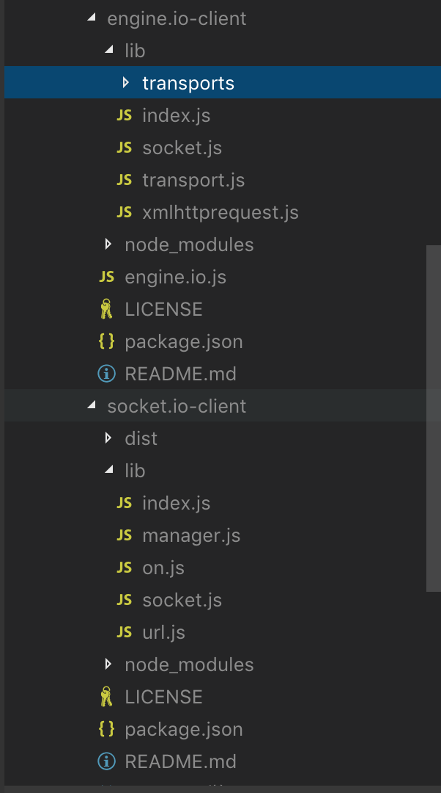
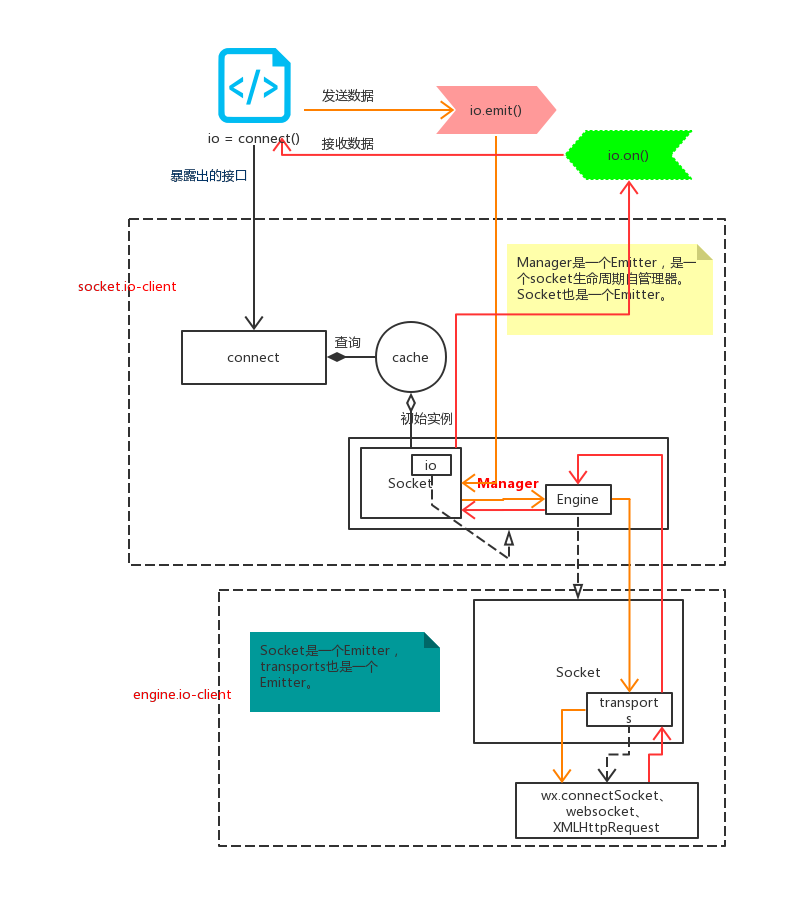
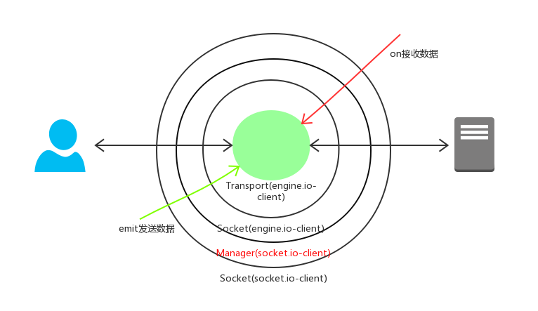

## 

## 实例
```html
<script src="/socket.io/socket.io.js"></script>
<script>
  var socket = io('http://localhost');
  socket.on('news', function (data) {
    console.log(data);
    socket.emit('my other event', { my: 'data' });
  });
</script>
```


## client 源码目录



## client 流程图
这是我阅读socket.io.client源码后画的原型图：



client 架构设计上采用了分层管理，几大模块负责不同的功能，这些模块的主要功能如下：

* socket(socket.io-client):

    它有个属性io是manager的实例，它实际上是manager划分出来的虚拟socket，它需要监听manager派发的事件。
    manager实际上派发了所有的socket，socket需要判断事件的命名空间是不是跟自己的一样，然后才能决定是否接收事件。

* manager:

    管理连接的复用，管理多个连接超时、重连、关闭等所有事件 。

    它是用命名空间划分socket，同一命名空间不同path的多个socket对应一个engine就是说socket(socket.io-client)跟socket(engine.io-client)是n:1的的关系。

    它的主要责任就是事件分发，它有个属性engine是socket(engine.io-client)的实例，通过监听engine将事件分发到多个socket(engine.io-client)。


* socket(engine.io-client):

    它持有transport实例，处理一些ping、pong、握手、消息接收等，作为transport和manager之间的事件和数据中介。它更接近于底层，需要处理好transport的升级切换。


* transport:

    跨浏览器和跨终端的传输层，它会根据环境和设置选择终端的client API(WebSocket、XMLHttpRequest、script等)来生成跟服务器连接的请求实例。并且监听请求实例的事件转发给上层，同时它将上层的调用传给请求实例。


## 事件流
整个client是基于eventEmitter，如果我们把发送和接收数据的事件流对比为DOM事件模型会很好理解。


发送事件就像事件捕获，从外层的manager到最里面的transport；接收数据就像事件冒泡，从最里面的transport到最外面的manager。

## 命名空间
我们可以实际跑一下连接复用的demo，然后看chrome的ws连接数量， 可以看到不同命名空间的socket只有一条ws连接。

socket.io的2个概念命名空间和房间对初学者来说很难拎清。我的理解是它们两是2个不同维度的划分，命名空间是对问题域的划分，使得同一条服务器和客户端连接可以处理不同的事务组。而房间是对socket连接的分组，将不同的客户端连接划分到不同的group。
如果你对命名空间和房间是如何实现的可以看我的另外一篇文章[《socket.io.server学习》](./socket.io.server学习.md)