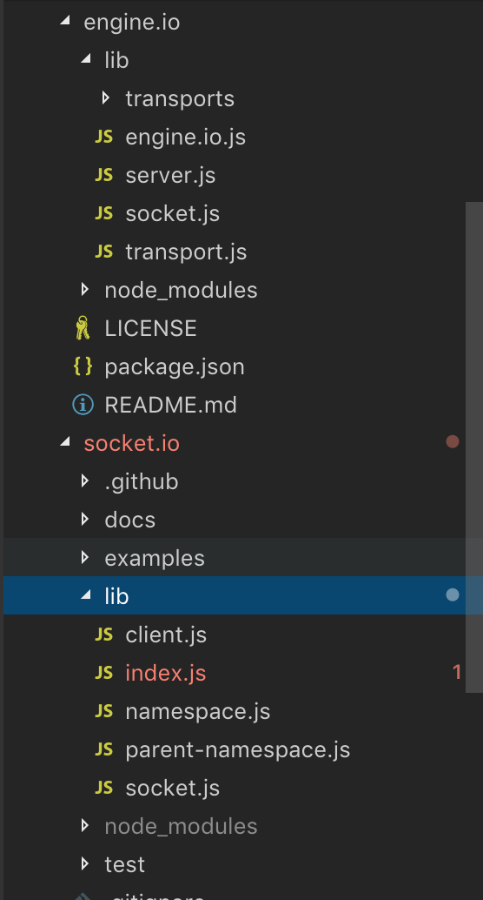

## 示例
如下我们在node server建立了一个简单的socket.io服务。

```javascript
var io = require('socket.io')(80);
var chat = io
  .of('/chat')
  .on('connection', function (socket) {
    socket.emit('a message', {
        that: 'only'
      , '/chat': 'will get'
    });
    chat.emit('a message', {
        everyone: 'in'
      , '/chat': 'will get'
    });
  });

var news = io
  .of('/news')
  .on('connection', function (socket) {
    socket.emit('item', { news: 'item' });
  });
```
socket.io 是如何设计和实现长连接服务的呢？

## server 源码目录


## server 流程图
这是我阅读socket.io.server源码后画的原型图：


server 架构设计上采用了分层管理，几大模块负责不同的功能，这些模块的主要功能如下：

* server(socket.io):

  调用socket.io 返回的就是这个server，它接收其他http.server服务，或者初始化的时候传入一个port number，它会自动创建一个http.server。它将http.server传给 server（engine.io）得到server（engine.io）的一个实例，并且注册server(engine.io)的connection事件回调。

  监听到server(engine.io)的connection事件后，回调函数里面传入了一个socket(engine.io)，将socket(engine.io)传给Client构造函数创建client对象。client创建一个socket(socket.io)添加进默认命名空间‘/’namespace对象。

  server监听和触发事件会转发给默认空间‘/’namespace对象。

  另外它会初始化adapter。

  它有一个责任是管理连接的复用，连接的复用是通过namespace对象。使用方式是调用server.of ，返回一个namespace。


* client(socket.io):

  client对象代表每个用户连接。

  client有个conn对象，它是socket(engine.io)对象。

  client监听socket(engine.io)的事件，有个data事件，解包data事件里面的数据包packet，如果发现packet是连接发起的新命名空间请求，则它会创建一个新的socket(socket.io)并把它添加进新命名namespace对象，并且触发namespace的connection事件。

* namespace(socket.io):

  命名空间，本质上 它有2个属性sockets数组和rooms数组。
  namespace接收到client创建的socket(socket.io)后，会把socket会添加进sockets数组。紧接着触发namespace的connection事件，回调函数里面传入了创建的socket(socket.io)，后续对连接的管理，主要就是操作这个socket。

  namespace emit事件的时候，会广播给它持有的所有rooms。

  它提供了进入和退出房间的接口，房间的实现依赖于adapter。向房间内广播消息需要通过adapter。

* socket(socket.io):

  它是由client创建并添加进命名空间的。client收到data数据的时候，会根据data中的nsp值，将data事件转发给合适的socket。

  它提供了进入和退出房间的接口，房间的实现依赖于adapter。向房间内广播消息需要通过adapter。

* server(engine.io):

  初始化的时候它attach了http.server, 然后它劫持http.server的request事件，如果请求的url符合socket.io规则，则连接处理由它处理，如果请求的url不符合socket.io规则，则由原来的request事件监听器处理。所以socket.io能整合进koa、express等其他http服务框架。

  它负责websocket连接的建立，默认情况下，客户端和服务器刚开始是polling http连接，后面尝试升级为websocket，如果失败滚回polling。为什么有这套机制，是因为虽然websocket所有现代浏览器都支持了，但依然可能因为用户代理、防火墙、云等复杂的环境因素造成服务器跟用户浏览器没法建立websocket连接。

  关于websocket, 可以阅读[《WebSocket 教程》](http://www.ruanyifeng.com/blog/2017/05/websocket.html) 。

  和客户端握手成功后，建立一个socket(engine.io)，并且触发connection事件。server(socket.io)的connection事件监听处理函数会收到这个socket(engine.io)，随后的过程可以看上面server(socket.io)小节说明。

* socket(engine.io):

  它是底层transport和上层通信的中介，它转发transport从客户端触发的事件，同时将上层server对客户端要触发的事件转发给transport处理。

  同时它处理websocket协议升级更细节的逻辑，比如跟客户端websocket连接建立超时。

* transport(engine.io):

  它是传输层的抽象，通过它上层可以不必关心是polling长轮询还是websocket，上层只需要使用socket(socket.io)。

## server和client 的通信协议

可以参考 [《socket.io 原理分析》](https://juejin.im/entry/5b3b388ae51d4519076922ce)